

<h1 >Eventygram - All that happens!</h1>

Eventygram is a Django Web App project that aims to be the go-to platform for finding and creating events and courses in Bulgaria, with plans to expand to Europe and worldwide. With a focus on providing a comprehensive range of events, courses, and activities, Eventygram offers users the opportunity to connect, learn, and discover new experiences.

<h2>Technology Used</h2>

    
Python

    
Django

    
HTML

    
CSS

    
PostgreSQL

<h2>Database Setup</h2>

To populate the database with Courses categories, use the SQL query provided in the <strong>populate_db_courses_categories.txt</strong> file.

<h2>Project Structure</h2>

    
TODO.txt: List of tasks to be done

    
courses_categories_as_dict.txt: File containing course categories as a dict for future reference

<h2>Features Implemented</h2>

    
* Three profile types for registration: Individual, Company, Organization

    
* Navbar with links to Home, Events, Courses, About, Contact

    
* User can view events, courses, comments, and use the contact form

    
* Profile dashboard for registered users with options for My Tickets, My Events, My Courses, and Inbox

    
* Ability to update profile details, upload picture, add balance, change password, and more

    
* Creation of events with options for free and priced tickets, unique ticket IDs, and event management

    
* Course categories, subcategories, reviews, ratings, and ability to create courses

    
* Messaging app for user communication and subscription feature

    
* Search bar for finding events, profiles, and courses

    
* Profiles have the functionality to be private or public for user control over visibility

    
* Authentication and authorization groups in the Django administration:

        
- Supervisors: View all apps database

        
- Managers: Change and view all apps database

        
- Moderators: Add, Change, Delete, and View all apps database

    

<h2>Get Involved</h2>

Contributions and feedback are welcome to help us grow and improve Eventygram. Let's make the platform a hub for events and courses worldwide. Join us on this journey of discovery, learning, and connection.

Thank you for your interest in Eventygram - All that happens!

Happy exploring! 🎉🌟

<h4>  ·  <a href="https://github.com/yDobreff/eventygram/blob/master/README.md"> Documentation </a>  ·  <a href="https://github.com/yDobreff/eventygram/issues"> Report Bug </a>  ·  <a href="https://github.com/yDobreff/eventygram/issues"> Request Feature </a> </h4>

# :notebook_with_decorative_cover: Table of Contents

 [About the Project](#star2-about-the-project)
 
 [License](#warning-license)
 
 [Contact](#handshake-contact)

## :star2: About the Project

    <a href="screenshots/1.png">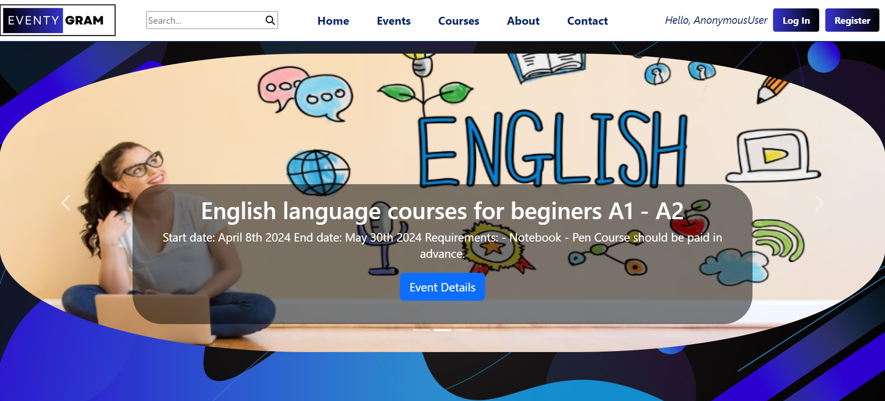</a>

    <a href="screenshots/2.png">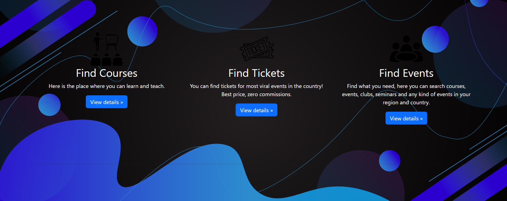</a>

    

    

    

    

    <a href="screenshots/7.png">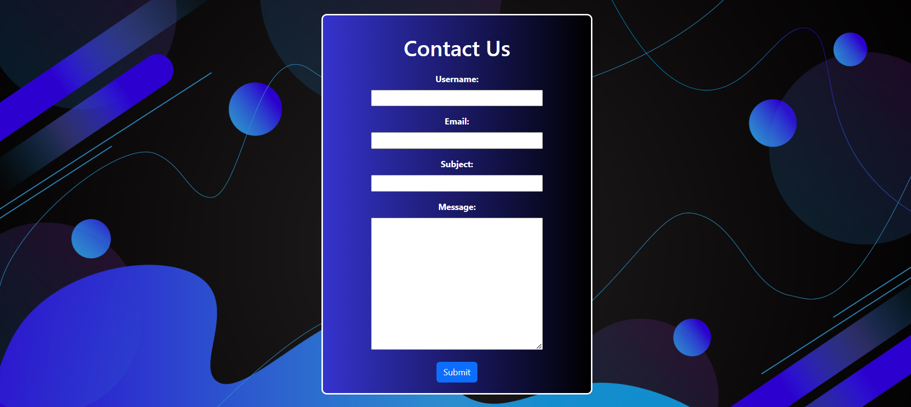</a>

    <a href="screenshots/8.png">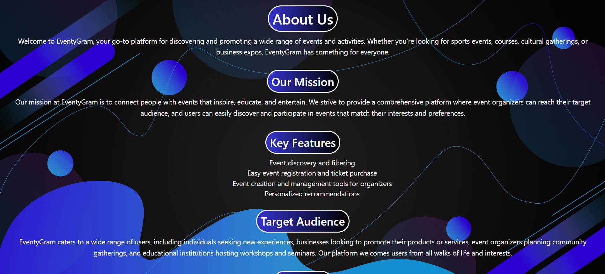</a>

    <a href="screenshots/9.png">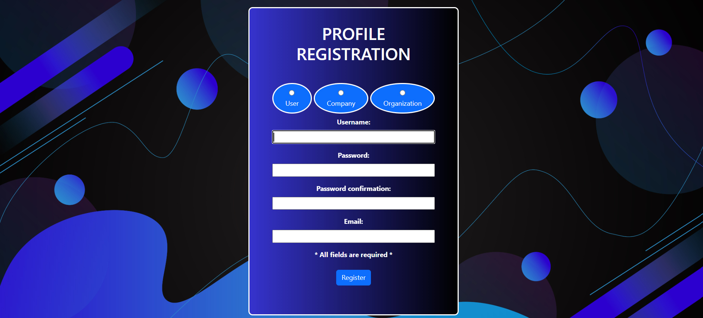</a>

    

    <a href="screenshots/11.png">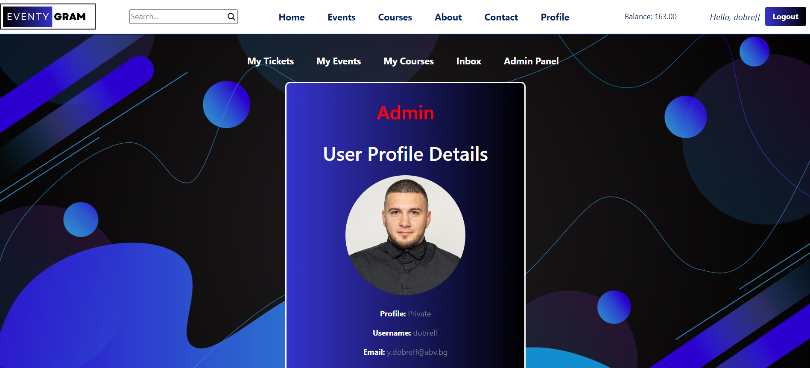</a>

    <a href="screenshots/12.png">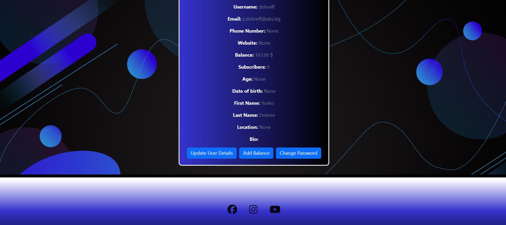</a>

    <a href="screenshots/13.png">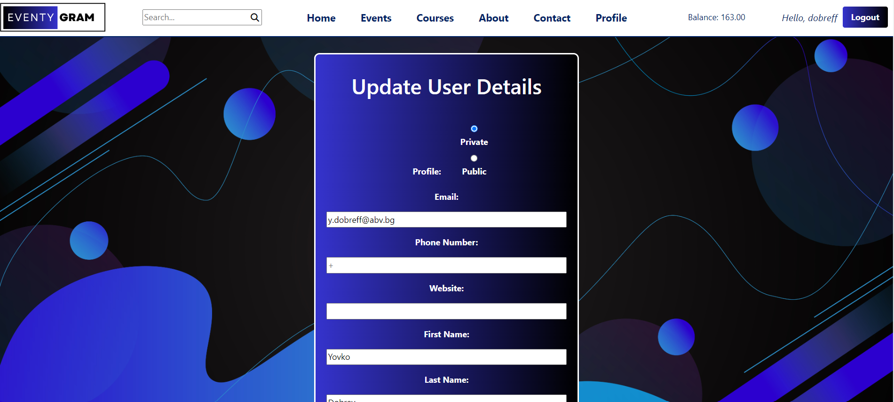</a>

    <a href="screenshots/14.png">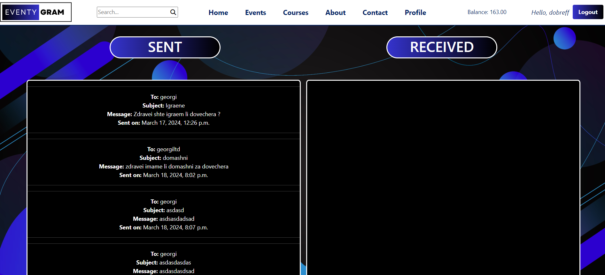</a>

    <a href="screenshots/15.png">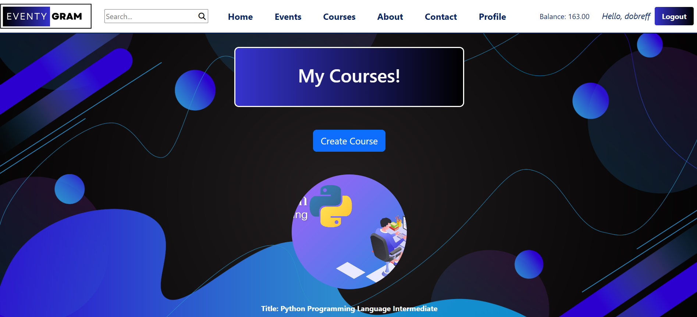</a>

    <a href="screenshots/16.png">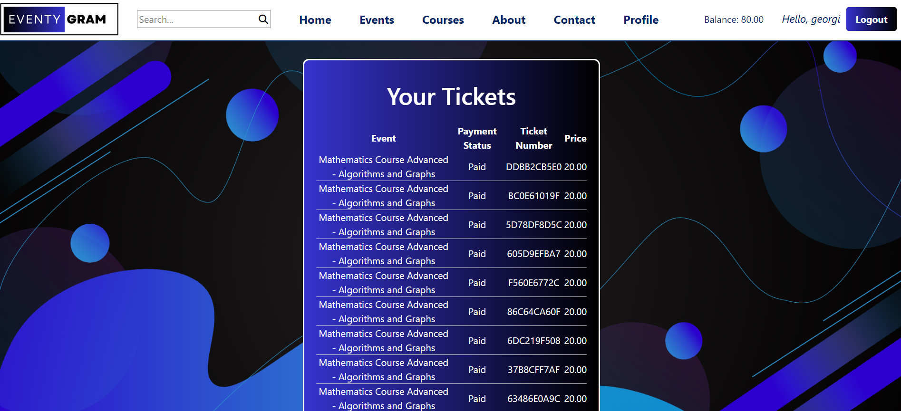</a>

    <a href="screenshots/17.png">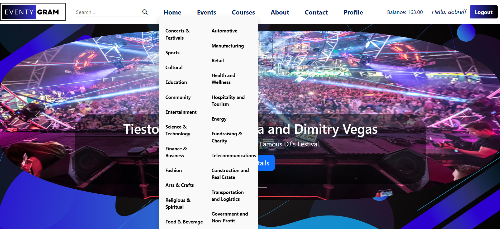</a>

    <a href="screenshots/18.png">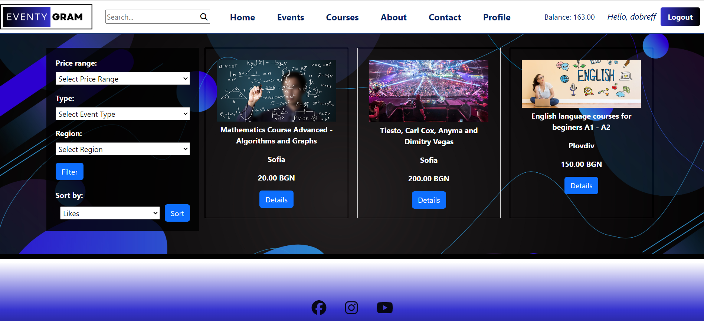</a>

    <a href="screenshots/19.png">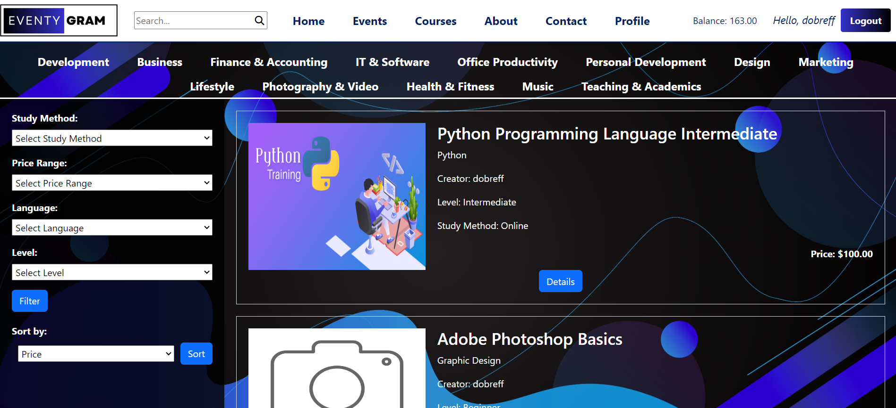</a>

### :dart: Planed Features
- Review and improve project error handling and error messages
- Implementation of a 'Cart' app
- Addition of a 'Notification' app
- Development of a 'Funding' app for profile balance, event, and course funding
- Integration of payment methods
- Dashboard for profile stats and analytics with a custom point system
- Chat rooms for courses and events, similar to DISCORD
- Incorporation of Vouchers/Coupons
- Internationalization and Localization for language translation
- Advanced course creation features such as multilevel dropdowns and content types
- Styling improvements using HTML and CSS

## :warning: License

Distributed under the MIT License. See LICENSE.txt for more information.

## :handshake: Contact

Yovko Dobrev - - y.dobreff@gmail.com

Project Link: - - [https://github.com/yDobreff/eventygram/](https://github.com/yDobreff/eventygram/)

LinkedIn - - [https://www.linkedin.com/in/dobrefff/](https://www.linkedin.com/in/dobrefff/)

Pastebin - - [https://pastebin.com/u/Dobrefff](https://pastebin.com/u/Dobrefff)
